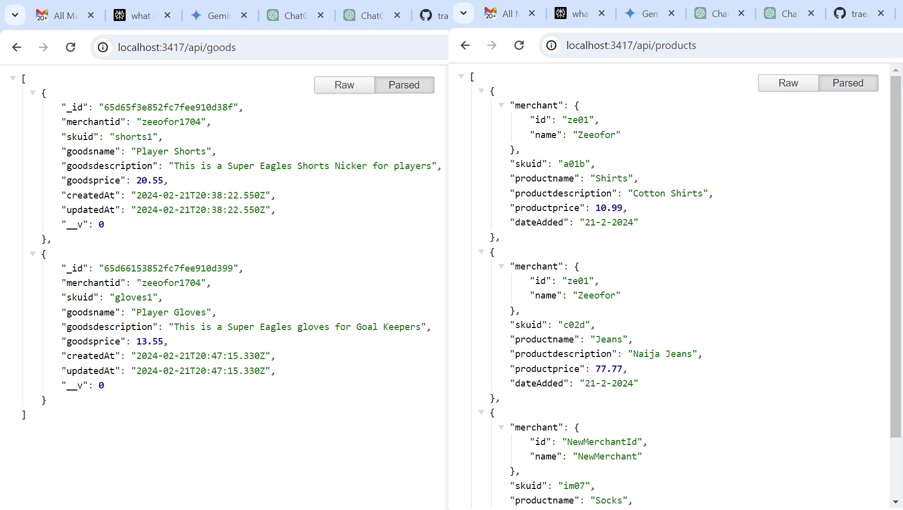
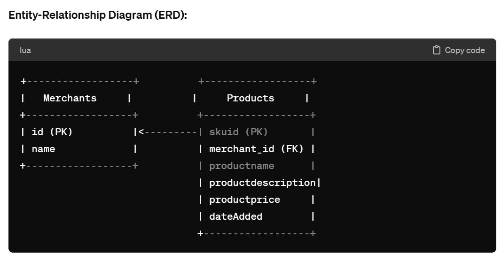

# Organogram Ltd's Backend Developer Test

This is my submission to the programming take home test (aka project, challenge or assignment). 

## Table of contents

- [Overview](#overview)
  - [The challenge](#the-challenge)
  - [Screenshot](#screenshot)
  - [Links](#links)
  - [My process](#my-process)
  - [Built with](#built-with)
  - [What I learned](#what-i-learned)
  - [Continued development](#continued-development)
  - [Useful resources](#useful-resources)
  - [Author](#author)
  - [Acknowledgments](#acknowledgments)
  - [Q2 Answers](#q2-answers)
  - [API Endpoints](#api-endpoints)
  - [API documentation](#api-documentation)

## Overview

### The Challenge/User Stories

This is confidential and included in Instructional email. 

### Screenshot

### Links

- Solution URL: [https://github.com/traez/organogramltd-backend-developer-test2](https://github.com/traez/organogramltd-backend-developer-test2)
- Live Site URL: [https://organogramltd-backend-developer-test2.onrender.com/](https://organogramltd-backend-developer-test2.onrender.com/)

## My process

### Built with

- Semantic HTML5 markup 
- CSS custom properties 
- Flexbox 
- CSS Grid 
- Mobile-first workflow 
- [React](https://reactjs.org/) - JS library 
- [Next.js](https://nextjs.org/) - React framework  
- Tailwind CSS  
- Typescript 
- Nodejs
- Expressjs
- MongoDB

### What I learned

- All things Backend Development, and a recollection of my MS Access knowledge. 

### Continued development

- Keep coding everyday and increasing competency!

### Useful resources

Stackoverflow  
YouTube  
Google  
ChatGPT

## Author

- Website - [Trae Zeeofor](https://github.com/traez)
- Twitter - [@trae_z](https://twitter.com/trae_z)

## Acknowledgments
 
-Jehovah that keeps breath in my lungs 

## Q2 Answers

Entity-Relationship Diagram (ERD): 
+------------------+          +------------------+
|   Merchants     |          |     Products     |
+------------------+          +------------------+
| id (PK)          |<---------| skuid (PK)       |
| name             |          | merchant_id (FK) |
+------------------+          | productname      |
                              | productdescription|
                              | productprice     |
                              | dateAdded        |
                              +------------------+

To design the database for optimal performance with a large number of merchants, I would use a relational database. I would also ensure proper indexing on key fields like merchant_id and skuid.

My choice of a database would be informed by the need for efficient handling of complex relationships, support for indexing and scalability to accommodate a large number of merchants and products.

## API Endpoints
Products Endpoints  

1. Get All Products  
Endpoint: /api/products/  
Method: GET  
Purpose: Retrieves a list of all products.  
Expected Output: An array of product objects.  

2. Get a Specific Product  
Endpoint: /api/products/:id  
Method: GET  
Purpose: Retrieves information about a specific product by its SKU ID.  
Required Input Parameters:  
id (String, the SKU ID of the product)  
Expected Output: The product object or an error message if the product is not found.  

3. Create a New Product  
Endpoint: /api/products/  
Method: POST  
Purpose: Creates a new product.  
Required Input Parameters:  
merchant (Object with id and name properties)  
productname (String, required)  
productdescription (String)  
productprice (Number, required)  
Expected Output: The newly created product object.  

4. Update a Product  
Endpoint: /api/products/:id  
Method: PUT  
Purpose: Updates information about a specific product by its SKU ID.  
Required Input Parameters:  
id (String, the SKU ID of the product)  
productname (String)  
productdescription (String)  
productprice (Number)  
Expected Output: The updated product object or an error message if the product is not found.  

5. Delete a Product  
Endpoint: /api/products/:id  
Method: DELETE  
Purpose: Deletes a specific product by its SKU ID.  
Required Input Parameters:  
id (String, the SKU ID of the product)  
Expected Output: A message indicating successful deletion or an error message if the product is not found.  

## API documentation
- App purpose is confidential as stated in Instructional email. Project is created with the MERN stack, plus in-memory data structure consisting of an array of objects.   
- To set up and run the project locally: Clone the Repository, Install Dependencies, Configure Environment Variables, then Run the Express.js Servers. Access the Application on http://localhost:1117